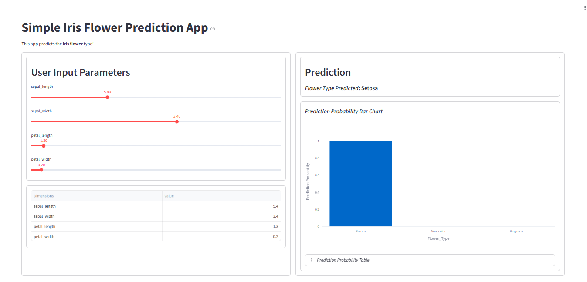

# Iris Flower Prediction Streamlit App

This is a simple web application built with Streamlit that predicts the type of Iris flower based on user input features. The app uses a Random Forest Classifier trained on the classic Iris dataset from scikit-learn.

## Features
- Interactive sliders for user input of flower dimensions (sepal length, sepal width, petal length, petal width)
- Real-time prediction of Iris flower type
- Probability bar chart and table for prediction confidence
- Clean, modern UI with two-column layout

## How It Works
1. The user selects values for the four flower dimensions using sliders.
2. The app predicts the flower type (Setosa, Versicolor, Virginica) using a trained Random Forest model.
3. The prediction and associated probabilities are displayed as a bar chart and table.

## Getting Started
### Prerequisites
- Python 3.8+

### Installation
1. Clone this repository:
	```bash
	git clone https://github.com/antaripg/iris-flower-pred-streamlit-app.git
	cd iris-flower-pred-streamlit-app
	```
2. Install required packages:
	```bash
	pip install streamlit scikit-learn pandas numpy plotly
	```

### Running the App
Start the Streamlit app with:
```bash
streamlit run app.py
```

Then open the provided local URL in your browser to interact with the app.

## File Structure
- `app.py`: Main Streamlit application
- `README.md`: Project documentation

## Screenshots



## License
This project is licensed under the MIT License.

## Author
- [antaripg](https://github.com/antaripg)

